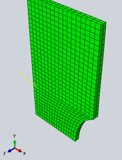

# getAbqOutput
Extract model coordinates and output quantities from an abaqus ODB. In addition, local coordinate systems are generated automatically in order to determine output quantities locally.


#### program execution
1. Run `getAbqOutput.py` via command line in the corresponding folder
````python
abaqus cae script=getAbqOutput.py
````
2. Extracted data is stored in `./output`


#### Automatic CSYS generation

